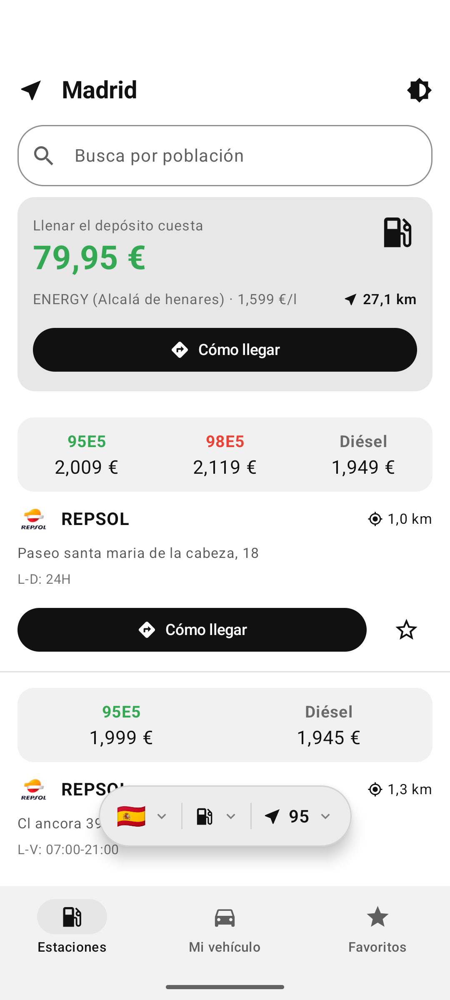
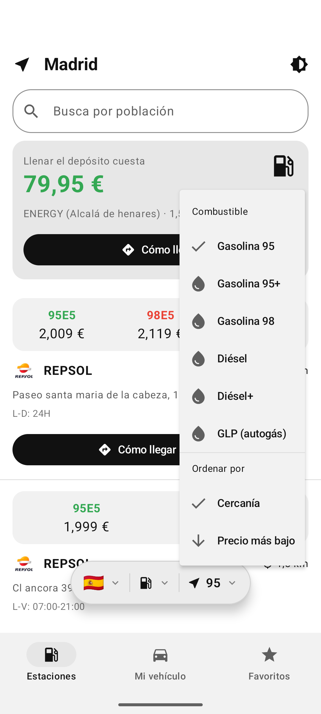
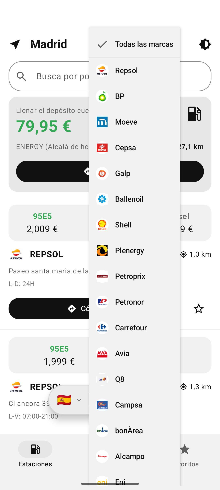
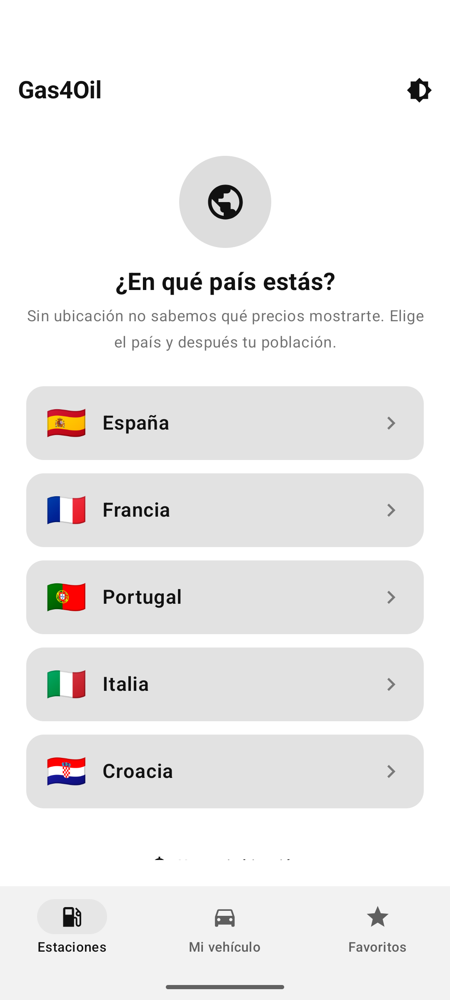
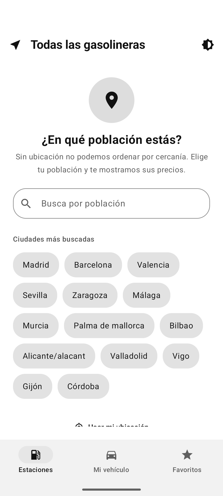
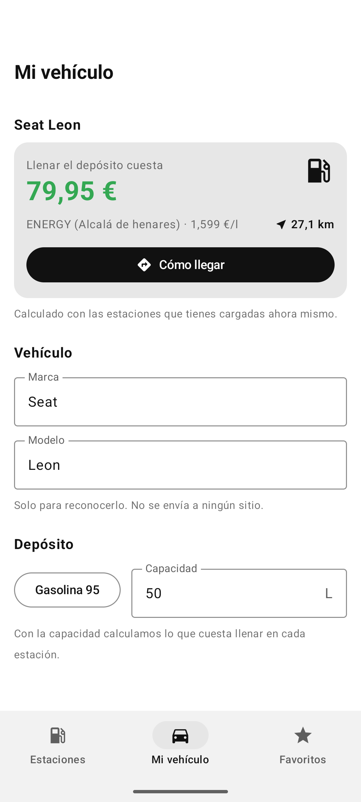

# Gas4Oil para Android

Precios de carburante por estación de servicio en España, Francia, Portugal, Italia y Croacia, con datos oficiales de cada país. Versión Android de [gas4oil-ios](https://github.com/aitorsola/gas4oil-ios).

## Descargar

El APK de cada versión está en [Releases](https://github.com/aitorsola/gas4oil-android/releases). Requiere Android 8.0 (API 26) o superior.

  
  
  

  
  
  

## Funciones

- Estaciones ordenadas por cercanía o por precio
- Selector de país; con ubicación se detecta automáticamente
- Búsqueda por población y selector de población cuando no hay ubicación
- Filtro por marca y por combustible (95, 95+, 98, diésel, diésel+, GLP, E10, E85 según el país) en una barra flotante que se oculta al desplazarte por la lista
- Coste de llenar tu depósito y la estación más barata a 50 km, con ruta
- Favoritos con precios actualizados
- Tema claro, oscuro o del sistema

## Fuentes de datos

| País | Fuente | Formato |
|---|---|---|
| España | Ministerio para la Transición Ecológica | JSON, ~12 MB |
| Francia | data.economie.gouv.fr | JSON comprimido, ~1 MB |
| Portugal | DGEG | JSON, ~4 MB |
| Italia | MIMIT | Dos CSV, ~6 MB |
| Croacia | Ministarstvo gospodarstva | JSON, ~4 MB |

Cada país es un caso de `Country` y una rama en `StationsApi`; los modelos de cada feed están en `Feeds.kt`.

## Arquitectura

Kotlin y Jetpack Compose (Material 3), un único `StationsViewModel` con `StateFlow`, OkHttp con TLS 1.2 forzado para el servidor español, kotlinx-serialization para los JSON y `LocationManager` con permiso de ubicación aproximada.

## Compilar

Android Studio con JDK 21. `./gradlew assembleRelease` genera el APK en `app/build/outputs/apk/release/`.
